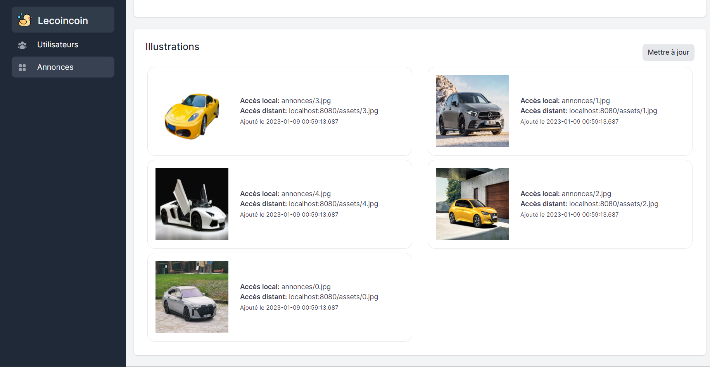

# Lecoincoin

Lecoincoin est une application grails simple et intuitive qui permet de gérer un site d'annonce. Elle permet plus précisement de gérer plusieurs utilisateurs de façon fluide et des annonces et leurs illustrations.

Dans la suite nous présenterons les deux grands modules de lecoincoin, son Backend et son API.

- [Généralité](#généralité)
- [Backend](#backend)
  - [Authentification](#authentification)
  - [Rôles et Utilisateurs](#rôles-et-utilisateurs)
  - [Gestion des utilisateurs](#la-gestion-des-utilisateurs)
  - [Gestion des annonces](#la-gestion-des-annonces)
  - [Mot de recherche](#le-moteur-de-recherche)
- [API](#api)

## Généralité

Globalement Lecoincoin propose les fonctionnalités pour la gestion d'un site d'annonce et imposé par le cahier des charges soumis. Ainsi Lecoincoin dispose des fonctionnalités suivantes:

- Opération CRUD sur les utilisateurs, annonces et illustrations 
- Gestion des utilisateurs : Client, Modérateur, Administrateur
- Gestion des annonces : Créer, Attribution et Gestion d'illustration
- Gestion des droits d'accès : Chaque utilisateur peut éffectuer un nombre limité d'actions
- API prenant en charge les méthodes GET / POST / PUT / PATCH et DELETE

En plus de ces fonctionnalités, nous avons ajouté **un moteur de recherche** pour la recherche rapide des annonces et insisté sur l'aspect esthétique du Backend. Par exemple par l'usage de photos pour tous utilsateurs.

Les fichiers important à consulter pour la découverte de notre production sont les suivants :

- [Collection Postman de l'API](/LECOINCOIN%20CLIENT%20API.postman_collection.json)
- [Documentation PDF de l'API](/ReadMe.pdf)
- [Vidéo de démonstration](/demo.mp4)

## Backend

Le backend de décompose en 4 grandes parties :

- L'authentification
- La gestion des utilisateurs
- La gestion des annonces
- Le moteur de recherche

### Rôles et Utilisateurs

Les différentes catégories d'utilisateur sont les suivants:

| Utilisateur    | Rôle          | Droits                                                                                                        |
|----------------|---------------|---------------------------------------------------------------------------------------------------------------|
| Client         | `ROLE_CLIENT` | Connexion, Voir ses annonces, Supprimer ses annonces                                                          |
| Modérateur     | `ROLE_MOD`    | Connexion, Modification et suppression des annonces, Consultation de tous les objets                          |
| Administrateur | `ROLE_ADMIN`  | Connexion, Création, Suppression, Modification des utilisateurs et annonces, Consultation de tous les objets  |

Lors du lancement de l'application, 1 administrateur est créé, 2 modérateurs sont créés, 20 clients sonts créés dont chacun possède 5 annonces où chacune possède 5 illustrations.

Tous les utilisateurs peuvent avoir une photo, un nom et un prénoms en plus de leur nom utilisateur. D'ailleurs tous les clients générés possède une photo. Les photos utilisées ont été générée par une IA ! Elles ne sont donc pas celles de personnes existantes.

### Authentification

#### Identifiants

Pour se connecter en tant qu'administrateur il suffit d'utiliser les identifiants suivant :

- Nom utilisateur : admin
- Mot de passe    : admin

Pour se connecter en tant que modérateur il est possible d'utiliser les identifiants suivant :

- Nom utilisateur : moderateur1
- Mot de passe    : password
- 
  Pour se connecter en tant que modérateur il est possible d'utiliser les identifiants suivant :

- Nom utilisateur : client1
- Mot de passe    : password

#### Accésibilité

Lors de la connexion les clients sont redirigés sur une page qui affiche uniquement leur annonces. Les autres utilisateurs ont accès à toute l'application dans la limite de leur rôle et droits

### La gestion des utilisateurs

Elle est reservée aux administrateurs dans le sens de la création. Les modérateurs peuvent consulter les profils des autres utilisateurs. Il est aussi possible de votre le nombre d'annonces de chaque utilisateur et voir leurs annonces en cliquant sur eux.

### La gestion des annonces

Elle permet aux modérateurs de modifier et supprimer les annonces. Seul les administrateurs peuvent en créer et attribuer des annonces à des clients.

### Le moteur de recherche

Il permet de rechercher une annonce rapidement à partir de son titre.

## API

l'API possèdent 3 groupes de endpoints :

- `/api/login` Pour l'authentification (Pour l'usage d'un access token)
- `/api/annonce(s)` Pour la manipulation des annonces
- `/api/user(s)` Pour la manipulation des utilisateurs

L'explication de l'usage de l'api est présente dans le pdf de documentation ([Documentation PDF de l'API](/ReadMe.pdf)) et les tests dans la collection postman
([Collection Postman de l'API](/LECOINCOIN%20CLIENT%20API.postman_collection.json))

## Bilan

L'objectif était de mettre en place un site de gestion d'annonces en grails ayant un backend et une api pour la gestion des annonces, utilisateurs et illustrations. On peut que l'objectif est a été atteint car nous disposons d'une application grails qui remplie la grande des charges imposée. Et en plus des fonctionnalité de bases nous avons enrichis les utilisateurs en leur ajoutant des photos et ajouté un moteur de recherche d'annonce. Cependant nous n'avons pas pu mettre en place un méchanisme de modification des photos et des mots de passe de utilisateurs ainsi qu'une option pour recherche les clients par leur nom. Malgré cela, nous espérons avoir fournir un travail correspondant suffisamment aux exigences établies.

### Crédits
- Jean-Marc Dje Bi
- Linsay Benoit
